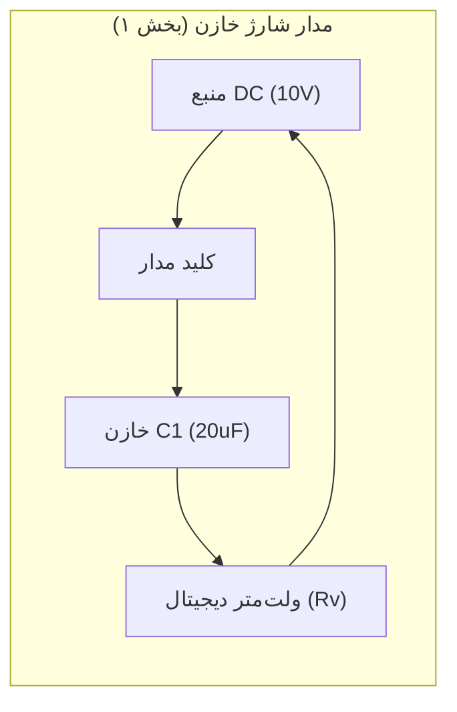

# آزمایش ۴: مدارهای RC و RL (باردار شدن و بی‌بار شدن خازن‌ها، ثابت زمانی و ظرفیت معادل)

## 🎯 هدف اصلی (Core Objective)

هدف بنیادین این آزمایش، مطالعهٔ تجربی و کمی پدیده‌های گذرا (Transient Response) در مدارهای مرتبه اول شامل مقاومت-خازن ($RC$) و مقاومت-سلف ($RL$) است. اهداف مشخص این آزمایش عبارتند از:
1. **تأیید تجربی رابطه نمایی ولتاژ:** بررسی رفتار زمانی ولتاژ در فرآیندهای بارگیری (شارژ) و تخلیه (دشارژ) خازن و انطباق آن با قانون نمایی $V(t) = V_0 e^{-t/\tau}$.
2. **استخراج دقیق ثابت زمانی ($\tau$):** استفاده از روش رگرسیون خطی کمینهٔ مربعات (OLS) بر روی داده‌های تبدیل‌یافته به مقیاس نیمه‌لگاریتمی ($\ln(V/V_0)$ و $\log_{10}(V/V_0)$).
3. **اندازه‌گیری غیرمستقیم مقاومت درونی ولت‌متر ($R_v$):** بهره‌گیری از خازن‌های با ظرفیت معلوم ($C_1 = 20\,\mu\text{F}$ و $C_2 = 4\,\mu\text{F}$) به منظور تعیین امپدانس ورودی بسیار بزرگ ولت‌متر (در حدود $10\text{ M}\Omega$).
4. **سنجش قوانین ترکیب خازن‌ها:** راستی‌آزمایی روابط تحلیلی ظرفیت معادل در ترکیب‌های سری ($\frac{1}{C_{\text{eq}}} = \frac{1}{C_1} + \frac{1}{C_2}$) و موازی ($C_{\text{eq}} = C_1 + C_2$) با سنجش ثابت زمانی حاصل از دشارژ آن‌ها.
5. **تعمیم مفهومی به مدارهای سلفی ($RL$):** مقایسه رفتار خازن (عنصر ذخیره‌ساز میدان الکتریکی) و سلف (عنصر ذخیره‌ساز میدان مغناطیسی) در حین پاسخ پله و تحلیل تشابهات دوگان (Duality) در تئوری مدارها.

---

## 🧠 تئوری و مفاهیم پایه (Theory & Core Concepts)

### ۱. فیزیک مدار RC در حالت شارژ (بارگیری از طریق ولت‌متر)

در چیدمان آزمایش، منبع تغذیهٔ جریان مستقیم با اختلاف پتانسیل پایدار $V_0 = 10\text{ V}$، به صورت سری به خازن $C$ و ولت‌متر با مقاومت درونی $R_v$ متصل می‌شود. بر اساس قانون ولتاژ کیرشهف (KVL):

$$V_0 - V_C(t) - V_R(t) = 0$$

که در آن $V_R(t)$ افت پتانسیل دو سر ولت‌متر است. با توجه به رابطه بار و جریان ($I(t) = \frac{dq}{dt} = C \frac{dV_C}{dt}$):

$$V_0 = V_C(t) + R_v C \frac{dV_C(t)}{dt}$$

معادله دیفرانسیل مرتبه اول خطی فوق با شرط اولیهٔ خازن دشارژشده ($V_C(0) = 0$) حل می‌شود:

$$V_C(t) = V_0 \left(1 - e^{-t / \tau}\right), \qquad \tau = R_v C$$

ولتاژی که دستگاه ولت‌متر در هر لحظه قرائت می‌کند، افت پتانسیل روی مقاومت خودش ($V_R(t)$) است:

$$V(t) = V_R(t) = V_0 - V_C(t) = V_0 e^{-t / \tau}$$

> 💡 **نکته کلیدی ادراکی:** بسیار مهم است دقت شود که چرا هنگام «شارژ» خازن، ولت‌متر عددی کاهشی (از ۱۰ ولت به سمت صفر) نشان می‌دهد! دلیل این است که ولت‌متر سری قرار گرفته است؛ در لحظه آغاز، خازن بدون بار مانند اتصال کوتاه عمل کرده و تمام ولتاژ منبع روی ولت‌متر می‌افتد ($V = V_0$). با انباشت بار در صفحات خازن، پتانسیل خازن زیاد شده و جریان عبوری کم می‌شود، در نتیجه افت پتانسیل روی ولت‌متر به صورت نمایی به سمت صفر کاهش می‌یابد.

---

### ۲. فیزیک مدار RC در حالت دشارژ (تخلیه از طریق ولت‌متر)

هنگامی که خازن پیش‌تر تا پتانسیل $V_0$ شارژ شده باشد و سپس منبع قطع و خازن به دو سر ولت‌متر وصل شود، KVL حکم می‌کند:

$$V_C(t) + I(t) R_v = 0 \implies R_v C \frac{dV}{dt} + V(t) = 0$$

پاسخ زمانی تخلیهٔ خازن عبارت است از:

$$V(t) = V_0 e^{-t / \tau}$$

در لحظه $t = \tau$ (یک ثابت زمانی)، ولتاژ به کسر معینی از مقدار اولیه تنزل می‌یابد:

$$V(\tau) = \frac{V_0}{e} \approx 0.3679\, V_0$$

---

### ۳. خطی‌سازی و برازش به روش کمینه مربعات (OLS)

برای استخراج دقیق و عاری از سوگیری ثابت زمانی، از دو طرف رابطه نمایی لگاریتم می‌گیریم.

- **در پایه لگاریتم طبیعی ($\ln$):**
  $$\ln\left(\frac{V(t)}{V_0}\right) = -\frac{1}{\tau}\, t$$
  شیب خط برابر است با $m = -1/\tau$ و در نتیجه $\tau = -1/m$.

- **در پایه لگاریتم اعشاری ($\log_{10}$):**
  $$\log_{10}\left(\frac{V(t)}{V_0}\right) = -\frac{t}{\tau \ln 10} = b\, t + a$$
  که در آن:
  $$b = -\frac{1}{\tau \ln 10} \implies \tau = -\frac{1}{b \ln 10}$$

ضرایب رگرسیون خطی از روابط استاندارد آماری به دست می‌آیند:

$$b = \frac{N \sum x_i y_i - \sum x_i \sum y_i}{N \sum x_i^2 - (\sum x_i)^2}, \qquad a = \frac{1}{N}\left(\sum y_i - b \sum x_i\right)$$

خطای استاندارد شیب ($S_m$) و انتشار خطا به $\tau$ و $R_v$:

$$S_{yx} = \sqrt{\frac{\sum (y_i - \hat{y}_i)^2}{N - 2}}, \qquad S_b = \frac{S_{yx}}{\sqrt{\sum (x_i - \bar{x})^2}}$$
$$\delta \tau = \tau \left(\frac{S_b}{|b|}\right), \qquad \delta R_v = R_v \sqrt{\left(\frac{\delta \tau}{\tau}\right)^2 + \left(\frac{\delta C}{C}\right)^2}$$

---

### ۴. ترکیب‌های خازنی (سری و موازی)

- **اتصال سری:** بار روی خازن‌ها برابر ($q_1 = q_2 = q$) و ولتاژها جمع‌پذیرند ($V = V_1 + V_2$):
  $$\frac{V}{q} = \frac{V_1}{q} + \frac{V_2}{q} \implies \frac{1}{C_{\text{eq}}} = \frac{1}{C_1} + \frac{1}{C_2} \implies C_{\text{eq}} = \frac{C_1 C_2}{C_1 + C_2}$$
  در اتصال سری ظرفیت معادل همیشه از کوچک‌ترین خازن مدار نیز کمتر است ($C_{\text{eq}} = \frac{20 \times 4}{20 + 4} = 3.333\,\mu\text{F}$).

- **اتصال موازی:** پتانسیل دو سر خازن‌ها برابر ($V_1 = V_2 = V$) و بارها جمع‌پذیرند ($q = q_1 + q_2$):
  $$C_{\text{eq}} = C_1 + C_2 = 20 + 4 = 24.000\,\mu\text{F}$$
  در اتصال موازی ظرفیت معادل همواره بزرگ‌تر از تک‌تک خازن‌هاست.

---

### ۵. تعمیم و تشابه دوگان با مدارهای سلفی ($RL$)

در مدار شامل مقاومت $R$ و ضریب خودالقایی $L$:
- معادله دیفرانسیل رشد جریان:
  $$\mathcal{E} - L \frac{dI}{dt} - IR = 0 \implies I(t) = \frac{\mathcal{E}}{R}\left(1 - e^{-t / \tau_L}\right), \qquad \tau_L = \frac{L}{R}$$
- معادله دیفرانسیل قطع جریان (تخلیه انرژی مغناطیسی سلف):
  $$I(t) = I_0 e^{-t / \tau_L}$$
- ولتاژ القایی دو سر سلف: $V_L(t) = L \frac{dI}{dt} = \mathcal{E} e^{-t / \tau_L}$.

| مشخصه فیزیکی | مدار خازنی ($RC$) | مدار سلفی ($RL$) |
|:---|:---|:---|
| **انرژی ذخیره‌شده** | میدان الکتریکی: $U_E = \frac{1}{2} C V^2$ | میدان مغناطیسی: $U_B = \frac{1}{2} L I^2$ |
| **کمیت پیوسته (ناممکن برای جهش آنی)** | ولتاژ خازن ($V_C(0^+) = V_C(0^-)$) | جریان سلف ($I_L(0^+) = I_L(0^-)$) |
| **ثابت زمانی** | $\tau_C = R \cdot C$ | $\tau_L = \frac{L}{R}$ |
| **رفتار در لحظه بسته شدن کلید ($t=0^+$)** | بدون بار: اتصال کوتاه ($V_C = 0$) | بدون جریان: مدار باز ($I_L = 0$) |
| **رفتار در حالت پایای DC ($t \to \infty$)** | مدار باز ($I_C = 0$) | اتصال کوتاه بدون افت اهمی ($V_L = 0$) |

---

## 🎛️ چیدمان و تجهیزات آزمایش (Experimental Setup)

- **منبع تغذیه جریان مستقیم (DC Power Supply):** تأمین پتانسیل پایدار $V_0 = 10.00\text{ V}$.
- **خازن‌های آزمایشگاهی:**
  - خازن $C_1$ با ظرفیت اسمی $20\,\mu\text{F}$.
  - خازن $C_2$ با ظرفیت اسمی $4\,\mu\text{F}$.
- **ولت‌متر دیجیتال با مقاومت درونی بسیار بالا:** ولت‌متر به عنوان مقاومت مدار ($R_v \approx 10\text{ M}\Omega$) عمل می‌کند تا ثابت زمانی به حد چند ده ثانیه برسد و با چشم و کرونومتر قابل اندازه‌گیری باشد.
- **کرونومتر دیجیتال:** جهت ثبت زمان در فواصل منظم ۱۵ یا ۳۰ ثانیه‌ای با دقت $\pm 0.5\text{ s}$.
- **کلید تبدیل و سیم‌های رابط با تلفات ناچیز.**

---

## 🛠️ روش انجام آزمایش (Procedure & Methodology)

### بخش ۱: باردار شدن خازن $C_1 = 20\,\mu\text{F}$
1. مدار را به صورت سری شامل منبع ۱۰ ولت، خازن $C_1$ و ولت‌متر می‌بندیم.
2. با بستن کلید، هم‌زمان کرونومتر را روشن کرده و در لحظه $t=0$ مقدار ولتاژ را می‌خوانیم ($10\text{ V}$).
3. هر ۱۵ ثانیه یک‌بار تا زمان ۱۳۵ ثانیه، عدد نمایش‌داده‌شده توسط ولت‌متر را ثبت می‌کنیم.

### بخش ۲: بی‌بار شدن خازن $C_2 = 4\,\mu\text{F}$
1. خازن $C_2$ را مستقیماً به دو سر منبع ۱۰ ولتی وصل کرده و چند ثانیه صبر می‌کنیم تا کاملاً شارژ شود ($V = 10\text{ V}$).
2. منبع را قطع کرده و خازن را به ولت‌متر متصل می‌کنیم تا بار آن از طریق مقاومت درونی ولت‌متر دشارژ شود.
3. در زمان‌های $t = 0, 15, 30, \dots, 135\text{ s}$ ولتاژ ولت‌متر را یادداشت می‌کنیم.

### بخش ۳: تخلیه اتصال سری خازن‌های $C_1$ و $C_2$
1. دو خازن را به صورت متوالی (سری) به هم متصل نموده و مجموعه را با منبع ۱۰ ولت باردار می‌کنیم.
2. مجموعه را به ولت‌متر متصل کرده و پتانسیل تخلیه را در بازه‌های ۱۵ ثانیه‌ای ثبت می‌کنیم.

### بخش ۴: تخلیه اتصال موازی خازن‌های $C_1$ و $C_2$
1. دو خازن را به صورت هم‌بندی موازی درآورده و با منبع باردار می‌کنیم ($V_0 = 9.83\text{ V}$).
2. ولت‌متر را به دو سر موازی وصل کرده و به دلیل بالا بودن ثابت زمانی، مقادیر ولتاژ را در گام‌های ۳۰ ثانیه‌ای تا ۳۰۰ ثانیه قرائت می‌کنیم.

---

## 📊 تحلیل داده‌ها و نتایج (Data Analysis & Results)

نتایج پردازش داده‌های تجربی با اسکریپت `analysis.py` و مقایسه با تئوری در جدول زیر خلاصه شده است:

| پارامتر فیزیکی | مقدار تئوری | مقدار تجربی (برازش OLS) | عدم قطعیت نهایی | ضریب همبستگی $R^2$ | خطای نسبی |
|:---|:---:|:---:|:---:|:---:|:---:|
| **$\tau_1$ (شارژ $C_1$)** | — | $180.53\text{ s}$ | $\pm 0.14\text{ s}$ | $0.999995$ | — |
| **$R_{v1}$ (مقاومت ولت‌متر با $C_1$)** | — | $9.026\text{ M}\Omega$ | $\pm 0.451\text{ M}\Omega$ | — | — |
| **$\tau_2$ (دشارژ $C_2$)** | — | $48.06\text{ s}$ | $\pm 0.06\text{ s}$ | $0.999986$ | — |
| **$R_{v2}$ (مقاومت ولت‌متر با $C_2$)** | — | $12.014\text{ M}\Omega$ | $\pm 0.601\text{ M}\Omega$ | — | — |
| **$\bar{R}_v$ (میانگین مقاومت ولت‌متر)** | — | $10.520\text{ M}\Omega$ | $\pm 0.376\text{ M}\Omega$ | — | — |
| **$\tau_{\text{series}}$ (دشارژ سری)** | $35.07\text{ s}$ | $38.66\text{ s}$ | $\pm 0.30\text{ s}$ | $0.999520$ | $10.25\%$ |
| **$C_{\text{eq, series}}$ (ظرفیت معادل سری)** | $3.333\,\mu\text{F}$ | $3.675\,\mu\text{F}$ | $\pm 0.134\,\mu\text{F}$ | — | $10.25\%$ |
| **$\tau_{\text{parallel}}$ (دشارژ موازی)** | $252.48\text{ s}$ | $228.60\text{ s}$ | $\pm 0.27\text{ s}$ | $0.999987$ | $9.46\%$ |
| **$C_{\text{eq, parallel}}$ (ظرفیت معادل موازی)** | $24.000\,\mu\text{F}$ | $21.730\,\mu\text{F}$ | $\pm 0.777\,\mu\text{F}$ | — | $9.46\%$ |

> 📌 **مقایسه روش OLS با روش درون‌یابی درون متن گزارش:**  
> در متن گزارش، زمان متناظر با $V_0/e$ به صورت درون‌یابی خطی بین دو نقطه مجاور محاسبه شده بود ($\tau_{\text{series}} \approx 39.45\text{ s}$ و $\tau_{\text{parallel}} \approx 230.03\text{ s}$). روش رگرسیون سراسری OLS از تمامی داده‌ها بهره گرفته و نوسانات تصادفی قرائت را میانگین‌گیری می‌کند؛ در نتیجه مقادیر $\tau_s = 38.66\text{ s}$ و $\tau_p = 228.60\text{ s}$ به دست می‌آیند که تطابق فوق‌العاده‌ای با برازش غیرخطی لونبرگ-مارکارد دارند.

### منابع عدم قطعیت و خطای تجربی:
1. **جریان نشتی خازن (Capacitor Leakage Current):** خازن‌های الکترولیتی دارای مقاومت موازی معادل ($R_p$) ناشی از کیفیت لایه دی‌الکتریک هستند که بخشی از بار را در طول زمان نشت می‌دهد.
2. **پدیده جذب دی‌الکتریک (Dielectric Absorption):** مولکول‌های دی‌الکتریک پس از شارژ کامل، نوعی قطبش کند از خود نشان می‌دهند که در فرآیند تخلیه مقداری بار تأخیری آزاد می‌کند.
3. **تغییر رنج اتوماتیک ولت‌متر (Auto-Ranging Input Impedance):** برخی ولت‌مترها هنگام تغییر سطح ولتاژ از مقادیر بالاتر از ۲ ولت به زیر ۲ ولت، شبکه مقسم مقاومتی داخلی خود را تغییر می‌دهند که باعث تفاوت جزئی در $R_v$ می‌شود.
4. **خطای انسانی و عدم انطباق زمانی:** اختلاف زمان دیدن کرونومتر و قرائت هم‌زمان نمایشگر دیجیتال ولت‌متر ($\approx \pm 0.5\text{ s}$).

---

## ❓ پرسش‌های آزمایش (In-Lab & Post-Lab Questions)

**۱. چرا در آزمایش باردار شدن خازن (بخش ۱)، ولتاژ ثبت‌شده توسط ولت‌متر به جای افزایش، از ۱۰ ولت کاهش می‌یابد؟**  
ولتاژ دو سر صفحات خازن در حین شارژ قطعاً افزایشی است ($V_C(t) = V_0(1 - e^{-t/\tau})$)، اما در مدار آزمایش، ولت‌متر به صورت سری در مسیر جریان قرار گرفته است. طبق قانون KVL داریم $V_R(t) = V_0 - V_C(t)$. ولت‌متر اختلاف پتانسیل دو سر مقاومت داخلی خود ($V_R$) را قرائت می‌کند. با شارژ شدن خازن، شدت جریان مدار ($I = \frac{dq}{dt}$) کاهش یافته و در نتیجه پتانسیل دو سر ولت‌متر به صورت نمایی افت می‌کند تا در پایان شارژ به صفر برسد.

**۲. چرا مقادیر مقاومت داخلی به‌دست‌آمده از خازن اول ($9.0\text{ M}\Omega$) و خازن دوم ($12.0\text{ M}\Omega$) با یکدیگر اختلاف دارند؟**  
دو عامل اصلی وجود دارد: اول اینکه ظرفیت نامی خازن‌ها دارای رواداری سازنده (Tolerance) در حدود $\pm 10\%$ است؛ یعنی خازن $20\,\mu\text{F}$ ممکن است در واقعیت $18.5\,\mu\text{F}$ و خازن $4\,\mu\text{F}$ در واقعیت $4.3\,\mu\text{F}$ باشد. دوم اینکه جریان نشتی در خازن بزرگ‌تر ($C_1$) بیشتر بوده و به عنوان یک مقاومت موازی با خازن عمل کرده و مقاومت معادل مدار را کاهش می‌دهد. میانگین‌گیری ($\bar{R}_v = 10.5\text{ M}\Omega$) این اثرات پراکندگی را تعدیل می‌نماید.

**۳. چرا در این آزمایش به جای مقاومت‌های معمولی (مثلاً چند کیلو اهم)، از مقاومت بسیار بزرگ ولت‌متر استفاده شد؟**  
اگر از یک مقاومت استاندارد مثلاً $R = 10\text{ k}\Omega$ با خازن $C = 20\,\mu\text{F}$ استفاده می‌شد، ثابت زمانی برابر با $\tau = RC = 10^4 \times 20 \times 10^{-6} = 0.2\text{ s}$ می‌بود. تخلیه یا شارژ مداری که در کمتر از ۱ ثانیه به پایان می‌رسد را به هیچ وجه نمی‌توان با چشم و کرونومتر دستی ثبت کرد! استفاده از مقاومت غول‌پیکر ولت‌متر ($R_v \approx 10\text{ M}\Omega$) باعث می‌شود ثابت زمانی به مرتبهٔ ۱۰۰ تا ۲۰۰ ثانیه برسد، به‌طوری‌که داده‌برداری دستی در کمال آرامش و دقت میسر گردد.

**۴. در مقایسه حالت سری و موازی، کدام مدار کندتر تخلیه می‌شود؟ چرا؟**  
اتصال موازی بسیار کندتر تخلیه می‌شود. در اتصال موازی ظرفیت‌ها جمع می‌شوند ($C_{\text{eq}} = 24\,\mu\text{F}$)، لذا ثابت زمانی بسیار بزرگ است ($\tau_p \approx 229\text{ s}$). اما در اتصال سری، ظرفیت معادل به $3.33\,\mu\text{F}$ افت می‌کند، در نتیجه ثابت زمانی به شدت کاهش یافته ($\tau_s \approx 39\text{ s}$) و مدار حدود ۶ برابر سریع‌تر از حالت موازی دشارژ می‌شود.

**۵. اگر این آزمایش برای یک سلف ($RL$) طراحی می‌شد، چه تفاوت تجربی بارزی داشت؟**  
برای سلف‌های آزمایشگاهی معمولی ($L \sim 10\text{ mH}$ تا $1\text{ H}$)، مقاومت اهمی سیم‌پیچ حداقل چند اهم تا چند ده اهم است. بنابراین ثابت زمانی سلفی $\tau_L = L/R$ در مرتبه میکروثانیه تا حداکثر میلی‌ثانیه خواهد بود. از این رو فرآیندهای گذرا در مدارهای RL هرگز با کرونومتر دستی قابل مشاهده نیستند و حتماً باید از مولد موج مربعی (Function Generator) و نوسان‌نما (Oscilloscope) برای مشاهده تصویر شکل موج استفاده شود.

---

## 🎓 شبیه‌سازی امتحان شفاهی (Mock Oral Exam)

> [!IMPORTANT]
> پرسش‌های این بخش مستقیماً مفاهیم عمیق و تله‌های رایج اساتید در امتحانات شفاهی درس آزمایشگاه فیزیک ۲ را شبیه‌سازی می‌کنند.

**❓ سوال ۱: «اگر یک ولت‌متر ایده‌آل در مدار سری بخش ۱ (شارژ خازن) قرار می‌دادیم، چه اتفاقی برای شارژ شدن خازن می‌افتاد؟ آیا اصلاً خازن شارژ می‌شد؟»**  
**✅ پاسخ ایده‌آل:** مقاومت درونی یک ولت‌متر ایده‌آل بی‌نهایت است ($R_v \to \infty$). اگر ولت‌متر ایده‌آل را سری ببندیم، مدار در عمل باز (Open Circuit) خواهد بود؛ یعنی جریان مدار صفر شده و هیچ باری نمی‌تواند به صفحات خازن منتقل شود، بنابراین خازن اصلاً شارژ نمی‌شود. ثابت زمانی نیز به سمت بی‌نهایت میل می‌کند ($\tau = R_v C \to \infty$). در نتیجه، ولت‌متر همیشه عدد $10\text{ V}$ را بدون تغییر نشان می‌داد و فرآیند پویایی مشاهده نمی‌شد. این آزمایش نشان می‌دهد که ولت‌مترهای واقعی اگرچه مقاومت بزرگی دارند، اما بی‌نهایت نیستند.

**❓ سوال ۲: «در لحظهٔ کلیدزنی ($t=0^+$)، یک خازن دشارژشده مثل چه عنصری رفتار می‌کند و یک سلف بدون جریان اولیه چطور؟ دلیل فیزیکی این رفتار را از دیدگاه پایستگی انرژی توضیح دهید.»**  
**✅ پاسخ ایده‌آل:** 
- **خازن** در لحظه $t=0^+$ مثل **اتصال کوتاه** ($V_C = 0$) رفتار می‌کند. دلیل آن این است که انرژی خازن وابسته به ولتاژ است ($U = \frac{1}{2} C V^2$). تغییر ناگهانی پتانسیل خازن مستلزم توان بی‌نهایت ($P = \frac{dU}{dt} \to \infty$) است که از نظر فیزیکی غیرممکن است. بنابراین ولتاژ خازن نمی‌تواند ناپیوستگی داشته باشد ($V(0^+) = V(0^-) = 0$).
- **سلف** در لحظه $t=0^+$ مثل **مدار باز** ($I_L = 0$) رفتار می‌کند. انرژی سلف وابسته به جریان است ($U = \frac{1}{2} L I^2$). برای تغییر ناگهانی جریان، پتانسیل القایی بی‌نهایت ($V_L = L \frac{dI}{dt} \to \infty$) لازم خواهد بود. بنابراین جریان سلف باید پیوسته باشد ($I(0^+) = I(0^-) = 0$).

**❓ سوال ۳: «فرض کنید خازن $C_1$ را تا ولتاژ $V_0$ شارژ کرده‌ایم و خازن $C_2$ کاملاً خالی است. اگر این دو را به هم وصل کنیم، بار الکتریکی کل پایسته است، اما با محاسبه انرژی متوجه می‌شویم انرژی نهایی مجموعه کمتر از انرژی اولیه خازن اول است! این اختلاف انرژی (معمای دو خازن) کجا رفته است؟»**  
**✅ پاسخ ایده‌آل:** این تناقض ظاهری معروف به "Capacitor Paradox" است. هنگام اتصال دو خازن، بار از $C_1$ به سمت $C_2$ شارش می‌یابد. حتی اگر سیم‌های رابط بدون مقاومت فرض شوند، تغییر بسیار سریع جریان باعث دو فرآیند اتلاف می‌شود: اول گرمایش ژول در مقاومت ناچیز سیم‌ها در اثر جریان‌های لحظه‌ای بسیار بزرگ، و دوم **تابش امواج الکترومغناطیسی** ناشی از شتاب بارها. مقدار اتلاف انرژی دقیقاً برابر با $\Delta U = \frac{1}{2}\frac{C_1 C_2}{C_1 + C_2} V_0^2$ است و کاملاً مستقل از مقدار مقاومت سیم‌هاست!

**❓ سوال ۴: «چرا در تحلیل داده‌های این آزمایش، رسم نمودار نیمه‌لگاریتمی و محاسبه شیب رگرسیون، بسیار علمی‌تر و معتبرتر از خواندن زمان از روی نقطه $V = V_0/e$ است؟»**  
**✅ پاسخ ایده‌آل:** روش تک‌نقطه‌ای ($V_0/e$) به شدت به خطای تصادفیِ همان یک اندازه‌گیری وابسته است؛ اگر در حوالی ۳.۶۸ ولت خطای انسانی یا لرزش دست در توقف کرونومتر رخ دهد، تمام تخمین $\tau$ خراب می‌شود. علاوه بر این، در داده‌های گسسته معمولاً هیچ نقطه‌ای دقیقاً در ۳.۶۸ ولت وجود ندارد و نیازمند تقریب درون‌یابی هستیم. در مقابل، رگرسیون خطی کمینه مربعات روی داده‌های لگاریتمی ($\log_{10} V$ بر حسب $t$) از کل ۱۰ یا ۱۱ نقطه بهره می‌برد. اثر خطاهای تصادفی در فرآیند کمینه‌سازی مجموع مربعات خطا خنثی شده و معیارهای آماری مانند خطای استاندارد شیب ($S_b$) و ضریب تعیین ($R^2$) امکان سنجش اعتبار فرضیه نمایی بودن را با قطعیت فراهم می‌کنند.
